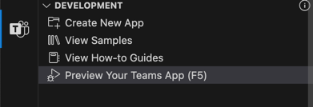
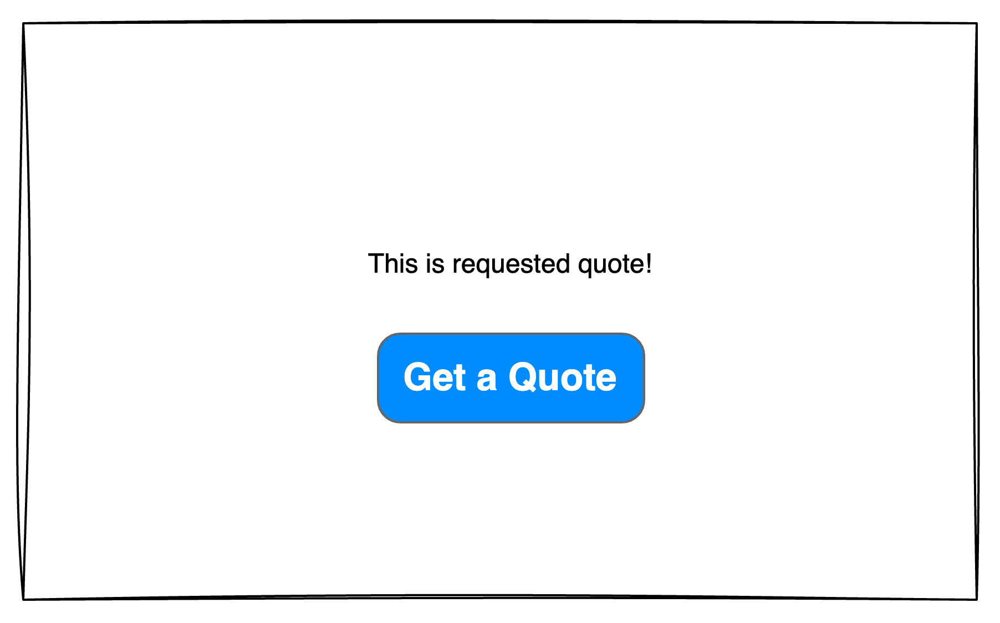
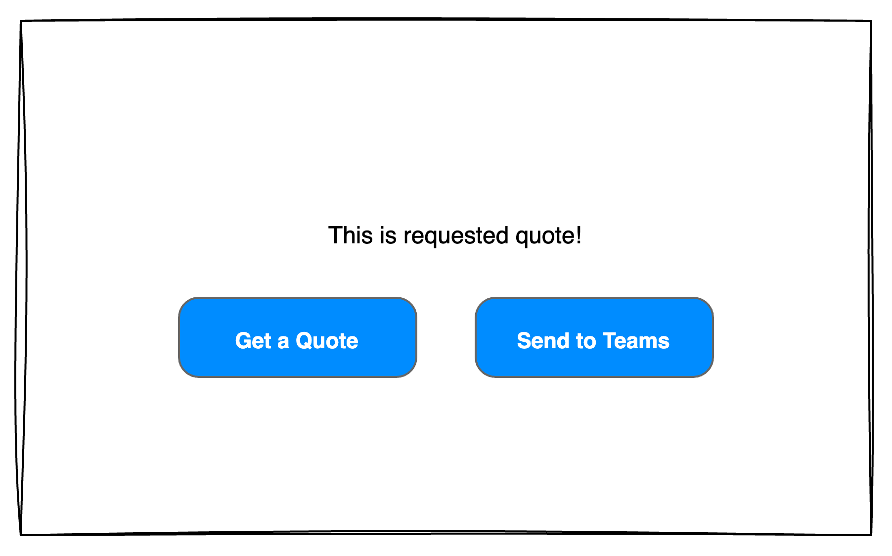
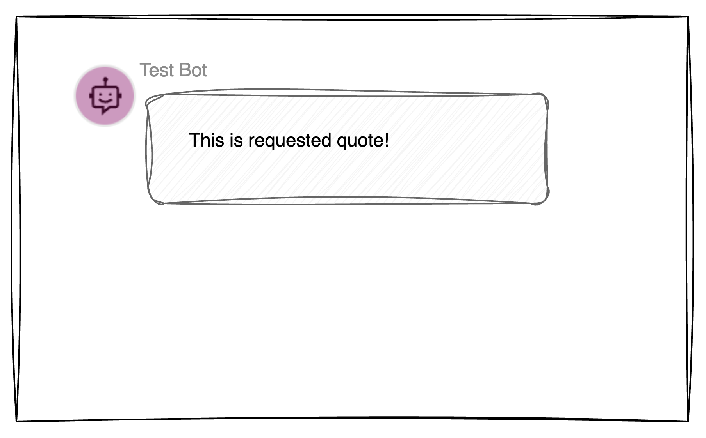
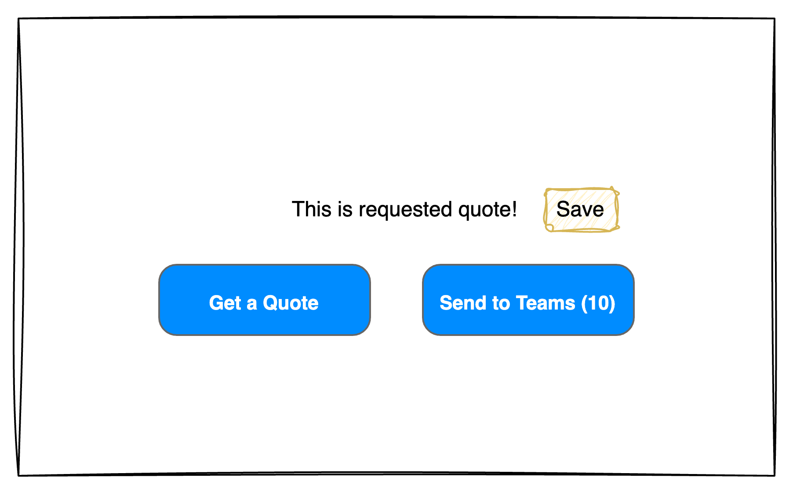
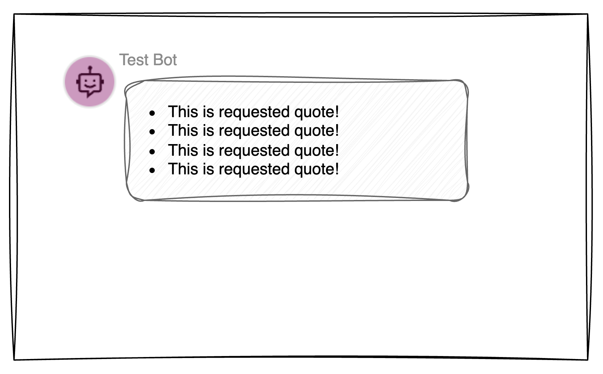

# PleazApS Test Assignment

We are currently working on developing a Microsoft Teams application, and this test assignment is designed not only to
evaluate your skills as a developer but also to give you an opportunity to explore the technologies and environments you
would work with if you decide to proceed with us.

### Overview of the Assignment

The test assignment requires you to create two separate applications:

1. A **frontend application** built with React.
2. A **Teams bot** that includes the ability to send notifications and integrate with the mentioned frontend.

We have divided the assignment into **three cases** We expect you to spend approximately
**4 hours** on this assignment. Please don’t stress if it takes more time than that—feel free to stop earlier if you
exceed the suggested timeframe. We would prefer to see **clean, functional code** for 1–2 cases rather than chaotic
implementations of all four cases.

### How to Use the Template

This repository provides two templates to help you get started:

1. **Microsoft Teams Notification Bot Template**  
   Located in the root directory, this is a pre-configured bot template for sending notifications in Microsoft Teams. It is just one of the templates without additional changes. To launch it:
    - Install Visual Studio Code and the Teams Toolkit extension to be able to run
   it: [Teams Toolkit documentation](https://learn.microsoft.com/en-gb/microsoftteams/platform/toolkit/install-teams-toolkit?tabs=vscode).
    - Run preview of the bot: Teams Toolkit -> Preview your Teams app -> Debug in Test Tool (any other option would require to have an MS Teams tenant with developer permissions, we **don't** expect you to make that). 
    - In `src/index.ts` you can find the code that sends the notification. You can test it by sending a POST request to `/api/notification` with your favorite tool (like `Postman`). Right now it sends a simple Adaptive Card to all personal installations (= installed for people personally, not in the chat) of bot.
    - If you need more information about template and its usage, read `MS.README.md`

2. **Frontend Application Template**  
   Located in the `frontend/` directory, this is a **Vite React-TS** template. To run the frontend application:
    - Navigate to the `frontend/` directory in your terminal.
    - Install the dependencies by running `npm install`.
    - Start the development server with `npm run dev`.
    - Access the application in your browser at the provided local development URL.

### Additional Notes

- Each case includes **instructions, descriptions of expected behavior, and simple sketches**. While we usually follow
  Figma designs for our projects, for simplicity, you have the freedom to decide how the applications should look. Note
  that the appearance doesn’t need to be perfect (it is not the test for a designer position), but some basic styling
  would be appreciated.
- You are free to use **any libraries or tools** that you find helpful, including UI libraries. There are **no
  limitations**—our main goal is to see your development approach and how you solve problems effectively.
- At the end of the assignment, we expect you to share links to **the repository, based on this template** (preferably on GitHub), using provided template. If you want to use different template, feel free to change template or replace it with your own.
- Please, document your work in the repository, so we can understand your thought process and decisions and how to run the applications if template was changed.

Please ensure your **code and commits are clean**, as we’d like to review your commit history, if possible.

---

## **Case 1: Frontend Application**

**User Story:**  
As a user, I want to generate random Chuck Norris quotes in a simple application so that I can enjoy humorous quotes
easily.




**Acceptance Criteria:**

- When I open the application, I see only a button labeled **"Get a Quote"**.
- When I click the button, the application fetches and displays a random Chuck Norris quote.
- Each subsequent click replaces the current quote with a new one.

**Other Requirements:**

- Use React to build the frontend application. You can use any template of your choice (Next.js, Create React App, Vite
  etc.). Put the code in the `frontend/` directory.
- Use [Chuck Norris API](https://chucknorris.io/) to fetch random quotes.

---

## **Case 2: Send a Quote to Yourself in Teams**

**User Story:**  
As a user, I want to send a Chuck Norris quote to myself in Microsoft Teams so that I can share or save the quote in a
convenient location.




**Acceptance Criteria:**

- A **"Send to Teams"** button is added to the application interface.
- When I click the button, the current quote is sent to me in Teams as a notification.
- The notification is either in plain text or formatted as an activity card for better readability.
- Scenario when there is no quote fetched yet should be handled gracefully.
- The notification should be sent **only to one user at a tim**e, so it should be possible to set userId (or other) in the interface to define the recipient.

_Note: In real life we would add our frontend as a personal static tab in Teams and we would know the user's id fron the context, but this implementation would require having a Teams tenant and developer permissions, so we don't expect you to do that._

## **Case 3: Send Multiple Quotes to Yourself in Teams**

**User Story:**  
As a user, I want to save my favorite Chuck Norris quotes and send them all at once to myself in Teams so that I can
keep track of the quotes I like.




**Acceptance Criteria:**

- I can mark quotes as favorites in the application.
- The application stores my favorite quotes in memory (no persistence is required).
- I can send all saved quotes to myself in Teams as a single notification.
- The notification lists all quotes either in plain text or as a structured activity card.

# Troubleshooting

### `TypeError: Cannot read properties of undefined (reading 'getClaimValue')`

If you're getting this error when sending a notification, then it means that for some reason Teams didn't create all required files.

To overcome this issue it is needed to create `.localConfigs` file with this content:
```
# A gitignored place holder file for local runtime configurations
BOT_ID=
BOT_PASSWORD=
```

And also add the same empty variables to `.localConfigs.testTool`

```
BOT_ID=
BOT_PASSWORD=
TEAMSFX_NOTIFICATION_STORE_FILENAME=.notification.testtoolstore.json
```
